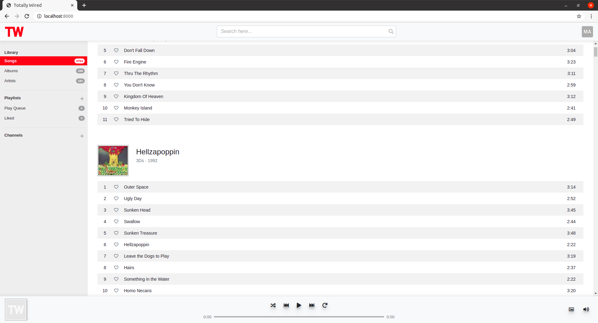

---

<br>

Bring your own music.

Combine the Spotify catalogue with your curated collection of mp3's and create group playlists with your friends.

<br>

## Docker (dev) setup

1. Create a `.env` file in the root directory, with the following (substituting xxx values with your values):
```
# Default docker-compose environment variables

DEBUG=True
SECRET_KEY=xxx

# Database
POSTGRES_DB = 'totallywired'
POSTGRES_USER = 'totallywired'
POSTGRES_PASSWORD=xxx

# A superuser will be created for you automatically
ROOT_USER = xxx
ROOT_EMAIL = xxx
ROOT_PASSWORD = xxx
```

2. run `docker-compose build`
3. run `docker-compose up`
4. Navigate to http://localhost:8000/
5. Login using your root user
6. Authorize access to your OneDrive account
7. Right now you need to manually run management commands to sync music and album art. The following series of commands should be used...
    - Attach a shell: `docker exec -it totallywired_web_1 bash`
    - Sync music: `python manage.py syncmusic --user {username} --provider {provider}`
    - Sync album art: `python manage.py syncthumbs --user {username} --provider {provider}`
    - __Note:__ `graph` aka OneDrive is the only supported `--provider` at this time.


## Screenshot


