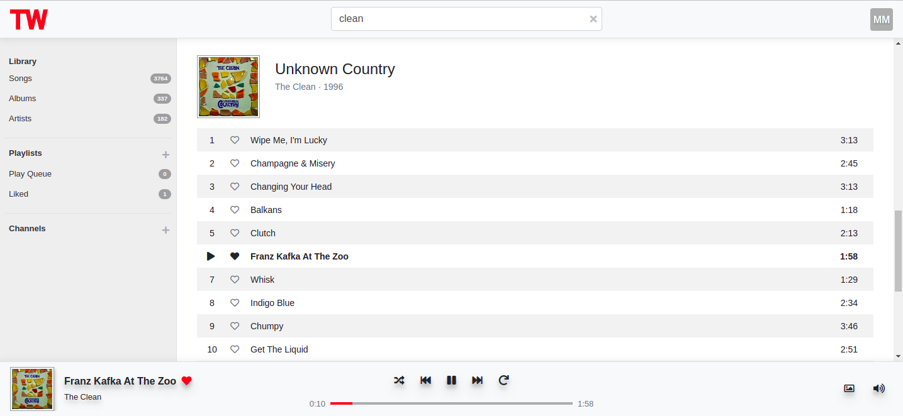

---

<br>

Bring your own music.

Play all your cloud stashed audio tracks with this web based player.

<br>

## Docker (dev) setup

1. Create an `.env` file in the project root directory, with the following (substituting xxx values with your values):
```
# Default docker-compose environment variables

DEBUG = "1"
SECRET_KEY = "xxx"

# Database
POSTGRES_DB = "totallywired"
POSTGRES_USER = "totallywired"
POSTGRES_PASSWORD = "xxx"

# RabbitMQ
RABBITMQ_ERLANG_COOKIE = "xxx"
RABBITMQ_DEFAULT_USER = "totallywired"
RABBITMQ_DEFAULT_PASS = "xxx"
RABBITMQ_DEFAULT_VHOST = "tw"

# A django superuser will be created for you automatically during initial build
ROOT_USER = "xxx"
ROOT_EMAIL = "xxx"
ROOT_PASSWORD = "xxx"

# OAuth

# This is necessary for testing with non-HTTPS localhost
# Remove this if deploying to production
OAUTHLIB_INSECURE_TRANSPORT = "1"

# This is necessary because Azure does not guarantee
# to return scopes in the same case and order as requested
OAUTHLIB_RELAX_TOKEN_SCOPE = "1"
OAUTHLIB_IGNORE_SCOPE_CHANGE = "1"

# OneDrive/Graph
GRAPH_APP_ID = "xxx"
GRAPH_APP_SECRET = "xxx"
GRAPH_REDIRECT_URI = "http://localhost:8000/providers/graph_callback"

```

2. run `docker-compose build`
3. run `docker-compose up`
4. Navigate to http://localhost:8000/
5. Login using your root user
6. Navigate to http://localhost:8000/#/account
7. Connect to any available providers
8. Sync music and art

---

## Screenshots




---
