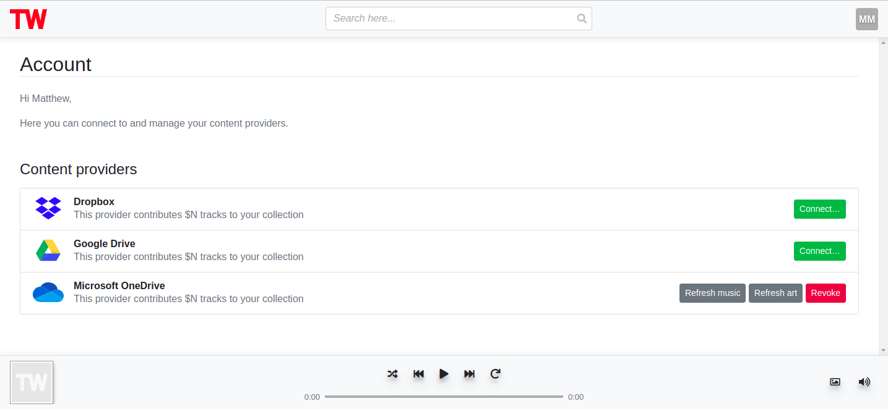

---

<br>

Bring your own music.

Combine the Spotify Library with your curated collection of mp3's and create group playlists with your friends.

<br>

## OneDrive Oauth configuration
You should create a `graph_oauth_settings.yml` configuration file in the project root directory, with the following (substituting xxx values with your values):

```
app_id: "xxx"
app_secret: "xxx"
redirect: "http://localhost:8000/providers/graph_callback"
scopes: "files.read offline_access"
authority: "https://login.microsoftonline.com/common"
authorize_endpoint: "/oauth2/v2.0/authorize"
token_endpoint: "/oauth2/v2.0/token"
```


## Docker (dev) setup

1. Create an `.env` file in the project root directory, with the following (substituting xxx values with your values):
```
# Default docker-compose environment variables

DEBUG=True
SECRET_KEY=xxx

# Database
POSTGRES_DB=totallywired
POSTGRES_USER=totallywired
POSTGRES_PASSWORD=xxx

# A superuser will be created for you automatically
ROOT_USER=xxx
ROOT_EMAIL=xxx
ROOT_PASSWORD=xxx
```

2. run `docker-compose build`
3. run `docker-compose up`
4. Navigate to http://localhost:8000/
5. Login using your root user
6. Navigate to http://localhost:8000/#/account
7. Connect to any available providers
8. Sync music and art

---

## Screenshots




---
